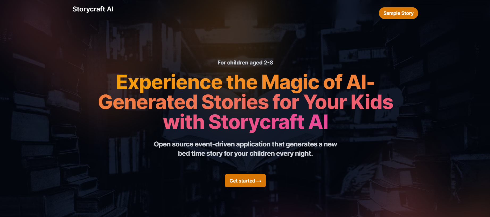
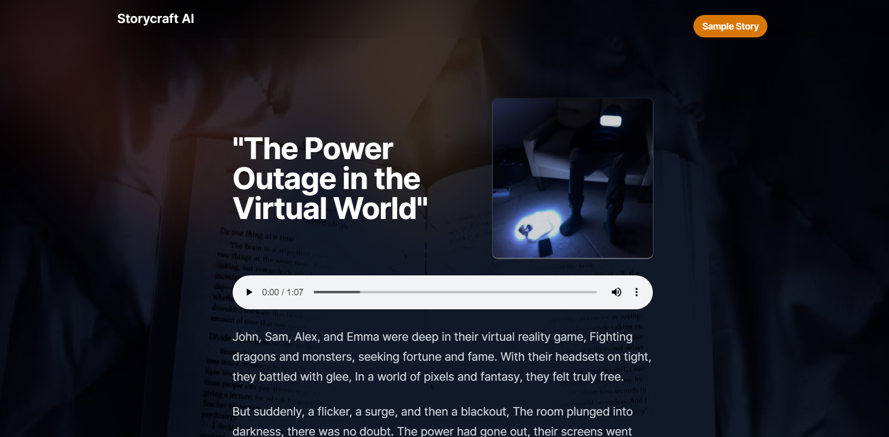

    <h1 align="center">StorycraftAI - AWS Serverless Stories Generator</h1>

  Generate unique stories for a personalized bedtime experience.

  
  

  <a href="#introduction"><strong>Introduction</strong></a> ·
  <a href="#features"><strong>Features</strong></a> ·
  <a href="#how-it-works"><strong>How It Works</strong></a> ·
  <a href="#tech-stack"><strong>Tech Stack</strong></a> ·
  <a href="#screenshots"><strong>Screenshots</strong></a> ·
  <a href="#author"><strong>Author</strong></a>

 

## Introduction

StorycraftAI is an an automated Event Driven AI bedtime story generation application using serverless technologies (AWS Lambda, EventBridge Scheduler), OpenAI for generating stories, DALL-E for images, and AWS Polly for text to speech, delivering unique stories, configured by parents, daily for a personalized bedtime experience.

## Features

- EventBridge Scheduler to generate new story every bedtime.
- Event architecture using Amazon EventBridge to fan out processing of images, audio and emails.
- New unqiue story every night using ChatGPT, DALL-E for images and Amazon Polly for Audio.
- Deployment with AWS CDK.

## How it works

1. Every day at a configured time an **EventBridge Schedule** is trigger which triggers a Lambda function.

2. The `create-story` lambda function takes characters and scenes from the **Amazon DynamoDB** tables and uses **ChatGPT** (OpenAI API) to create the story. The story is stored with a 2 day TTL in DynamoDB.

3. An Amazon **EventBridge Pipe** is configured to **listen to all New items created inside the table using streams** and triggers an **Amazon EventBridge event** (StoryCreated).

4. EventBridge routes the `StoryCreated` event to three targets:

- **SNS** for email
  - SNS for email: SNS is used in this example to notify the user that a new story has been created.
- **AWS Lambda** function for Audio generation
  - Lambda for Audio: Amazon Polly is created to create audio for the story that has been generated. The audio file is stores into S3 with a signed URL (for 2 days).
- **AWS Lambda** function for image generation.
  - Lambda for image generation: This function takes the story and scene and creates an image for the story using DALL-E (OpenAI API). This image is stored inside S3 with a signed URL (2 days).

5. The frontend application is running on **AWS App Runner** and is hosting a NextJS SRR application. When the user goes to the URL in the Email (through SNS topic), the story is loaded and displayed.

## Tech Stack

- Typescript
- [NextJS](https://nextjs.org/)
- [AWS](https://aws.amazon.com/)
- [Tailwind CSS](https://tailwindcss.com/)
- [OpenAI](https://openai.com/blog/openai-api)

## Screenshots

### Home Page

### Story Page

## Author

- Anchit Sinha ([@anchit1909](https://twitter.com/anchit1909))
